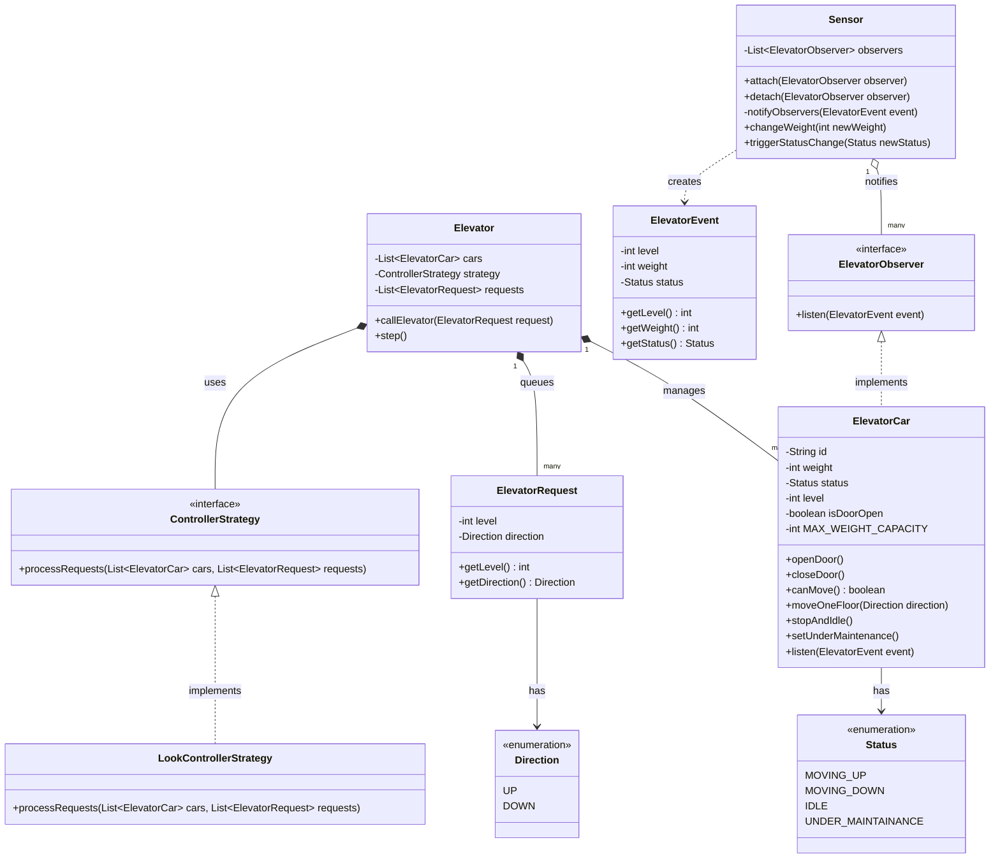

```mermaid
classDiagram
    class Elevator {
        -List~ElevatorCar~ cars
        -ControllerStrategy strategy
        -List~ElevatorRequest~ requests
        +callElevator(ElevatorRequest request)
        +step()
    }

    class ControllerStrategy {
        <<interface>>
        +processRequests(List~ElevatorCar~ cars, List~ElevatorRequest~ requests)
    }

    class LookControllerStrategy {
        +processRequests(List~ElevatorCar~ cars, List~ElevatorRequest~ requests)
    }

    class ElevatorCar {
        -String id
        -int weight
        -Status status
        -int level
        -boolean isDoorOpen
        -int MAX_WEIGHT_CAPACITY
        +openDoor()
        +closeDoor()
        +canMove() boolean
        +moveOneFloor(Direction direction)
        +stopAndIdle()
        +setUnderMaintenance()
        +listen(ElevatorEvent event)
    }

    class ElevatorObserver {
        <<interface>>
        +listen(ElevatorEvent event)
    }

    class Sensor {
        -List~ElevatorObserver~ observers
        +attach(ElevatorObserver observer)
        +detach(ElevatorObserver observer)
        -notifyObservers(ElevatorEvent event)
        +changeWeight(int newWeight)
        +triggerStatusChange(Status newStatus)
    }

    class ElevatorEvent {
        -int level
        -int weight
        -Status status
        +getLevel() int
        +getWeight() int
        +getStatus() Status
    }

    class ElevatorRequest {
        -int level
        -Direction direction
        +getLevel() int
        +getDirection() Direction
    }

    class Status {
        <<enumeration>>
        MOVING_UP
        MOVING_DOWN
        IDLE
        UNDER_MAINTAINANCE
    }

    class Direction {
        <<enumeration>>
        UP
        DOWN
    }

    Elevator "1" *-- "many" ElevatorCar : manages
    Elevator "1" *-- "many" ElevatorRequest : queues
    Elevator *-- ControllerStrategy : uses
    ControllerStrategy <|.. LookControllerStrategy : implements
    ElevatorObserver <|.. ElevatorCar : implements
    Sensor "1" o-- "many" ElevatorObserver : notifies
    Sensor ..> ElevatorEvent : creates
    ElevatorCar --> Status : has
    ElevatorRequest --> Direction : has
```
